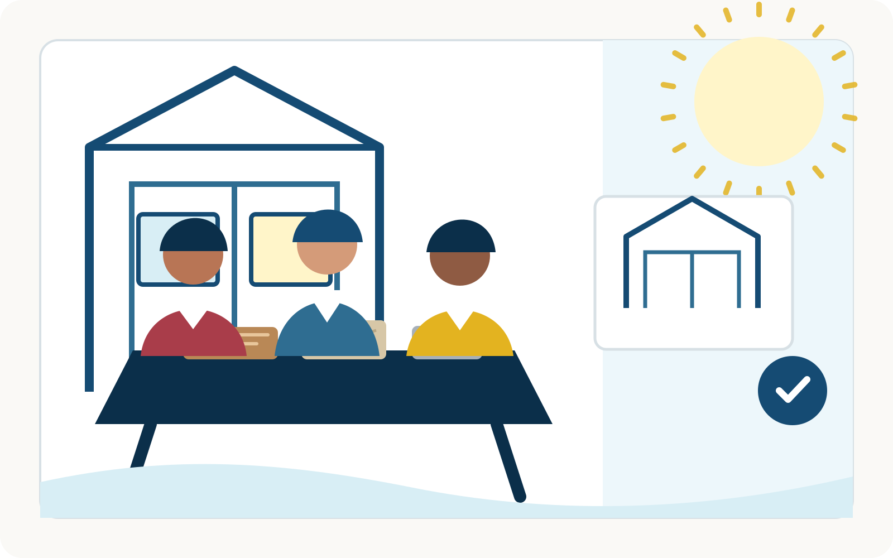
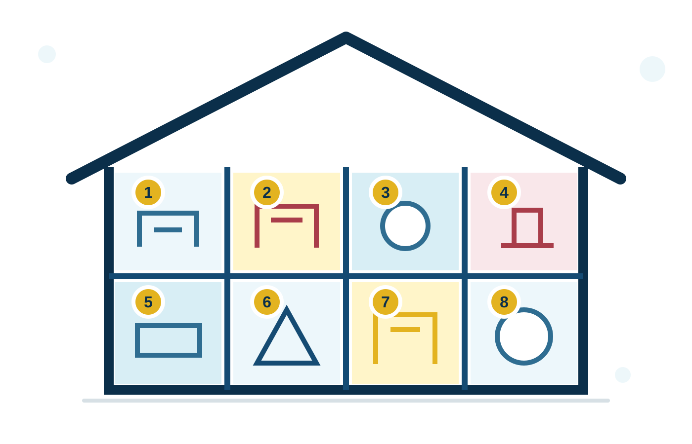
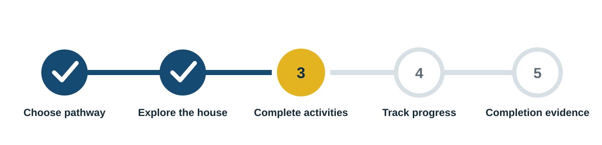
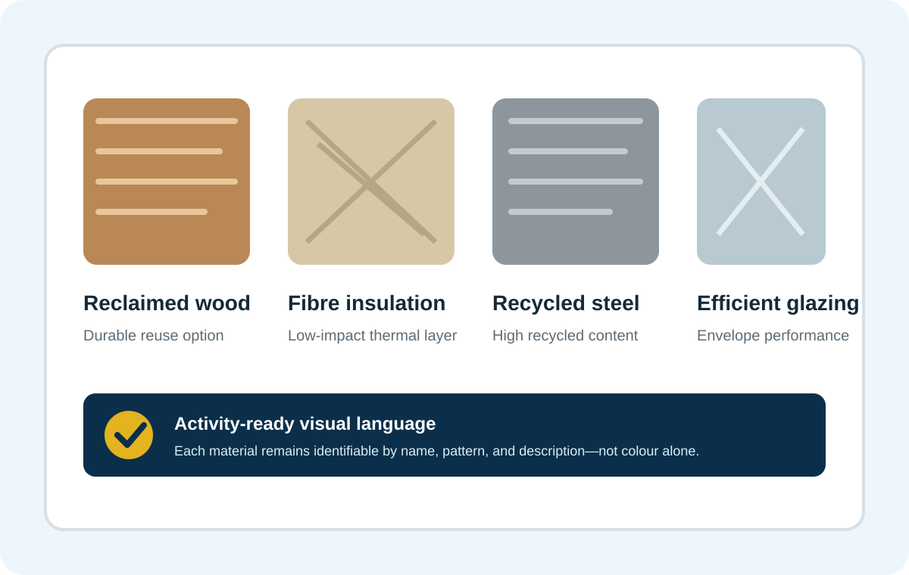
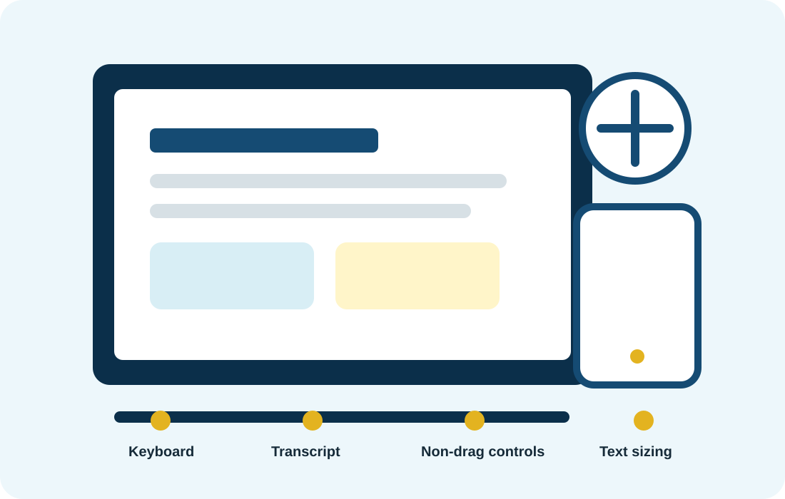

# V4 Asset Gallery

## Signature illustrations

## Sprites

The remaining scenes, textures, patterns, and icons are stored as reusable SVG symbols:

- `public/assets/v4/images/context-scenes.svg`
- `public/assets/v4/materials/materials-sprite.svg`
- `public/assets/v4/patterns/brand-patterns.svg`
- `public/assets/v4/icons/ui-icons.svg`
